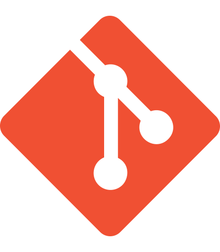
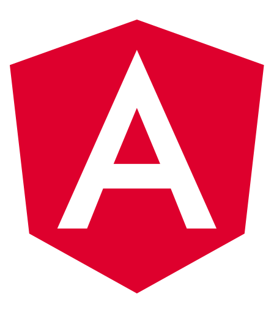
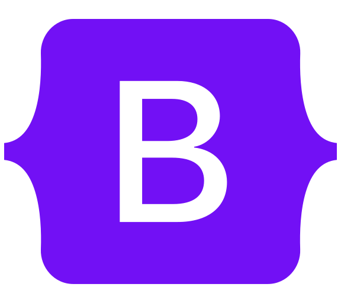

## Clayton Leonard Cook | Software Engineer

**Saginaw, Michigan** | [claytonleonardcook@protonmail.com](mailto:claytonleonardcook@protonmail.com)

 

August&nbsp;2022 - Present
### **Cellar&nbsp;Door @ Factimize** | Remote
&nbsp;HTML5&nbsp;
&nbsp;SCSS&nbsp;
&nbsp;Typescript
&nbsp;React&nbsp;
&nbsp;GraphQL&nbsp;
&nbsp;GIT
<ul>
    <li>Created and designed user interface for client dashboard.</li>
    <li>Communicated with team to plan out best next steps for the project timeline.</li>
    <li>Discussed and implemented optimized ways to display large amounts of data.</li>
    <li>Researched offline web applications with backend payloads.</li>
</ul>

 

May&nbsp;2022 - August&nbsp;2022
### **Cellar&nbsp;Door @ Peloton** | Remote
&nbsp;HTML5&nbsp;
&nbsp;SCSS&nbsp;
&nbsp;Typescript&nbsp;
&nbsp;React&nbsp;
&nbsp;GraphQL&nbsp;
&nbsp;GIT&nbsp;
<ul>
    <li>Wrote custom GraphQL queries to retrieve component data from Contentful CMS.</li>
    <li>Followed atomic design to use existing atoms to create molecules and pages.</li>
    <li>Opened pull requests and reviewed code for quality assurance.</li>
    <li>Worked with external teams for quality assurance and design.</li>
</ul>

 

January&nbsp;2021 - February&nbsp;2021
### **Onflo @ DirectKey** | Remote
&nbsp;HTML5&nbsp;
&nbsp;SCSS&nbsp;
&nbsp;Javascript&nbsp;
&nbsp;React&nbsp;
&nbsp;GIT&nbsp;
<ul>
    <li>Migrated media assets and content from existing site over to React project.</li>
    <li>Groomed JIRA tickets with dev team and code reviewed PRs on GitHub.</li>
    <li>Worked in branches to organize and merge new features deployed in production.</li>
    <li>Followed design mocks to develop email blast sent to thousands of customers.</li>
</ul>

 

December&nbsp;2019 - March&nbsp;2020
### **Onflo @ Dinr&nbsp;TVC** | Saginaw,&nbsp;MI
&nbsp;HTML5&nbsp;
&nbsp;SCSS&nbsp;
&nbsp;Typescript&nbsp;
&nbsp;React&nbsp;
&nbsp;Redux&nbsp;
&nbsp;Firebase&nbsp;
&nbsp;GIT&nbsp;
<ul>
    <li>Wrote helper functions with Jest unit tests to format data used on frontend.</li>
    <li>Configured React router to handle URL parameters used for application logic.</li>
    <li>Refactored components and located/migrated shared component logic.</li>
    <li>Worked with the frontend development team using Github to manage codebase.</li>
</ul>

 

June&nbsp;2018 - July&nbsp;2018

### **Onflo @ Perfect&nbsp;Landing&nbsp;Rentals&nbsp;TVC** | Tawas,&nbsp;MI
&nbsp;HTML5&nbsp;
&nbsp;SCSS&nbsp;
&nbsp;Javascript&nbsp;
&nbsp;Angular&nbsp;
&nbsp;Bootstrap&nbsp;
&nbsp;Firebase&nbsp;
&nbsp;GIT&nbsp;
<ul>
    <li>Collaborated with frontend team to develop CRUD dashboard for use by client.</li>
    <li>Helped integrate Firebase (a realtime database) into dashboard to handle client data.</li>
    <li>Developed a login page using Firebase Auth to authenticate and signup users.</li>
    <li>Wrote Firebase rules to validate and sanitize user inputs being sent in API requests.</li>
</ul>

 

<h2 style="color: #02c39a;">Education</h2>

September&nbsp;2019 - Present
### **Saginaw&nbsp;Valley&nbsp;State&nbsp;University** | Bachelor&nbsp;of&nbsp;Science&nbsp;in&nbsp;Computer Engineering
<ul>
    <li>Attended Java classes to learn syntax, major data structures, and algorithms.</li>
    <li>Deployed a React/Firebase application for web development class.</li>
    <li>Worked alongside professor as a student researcher for deep learning.</li>
    <li>Tutored peers in languages like Java, C, C++, Visual Basic, and Javascript.</li>
</ul>

 

<h2 style="color: #02c39a;">Activites&nbsp;&amp;&nbsp;Accomplishments</h2>

2022 - Present
 
**Cardinal&nbsp;Robotics&nbsp;Club** | President

2022 - Present
 
**Google&nbsp;Developer&nbsp;Student&nbsp;Club** | Vice&nbsp;President

2021 - Present
 
**Association&nbsp;of&nbsp;Computer&nbsp;Machinery** | Member

2019 - 2022
 
**Science&nbsp;Olympiad** | Coach

November&nbsp;2021
 
**CS&nbsp;Department&nbsp;Coding&nbsp;Competition** | 2nd&nbsp;Place